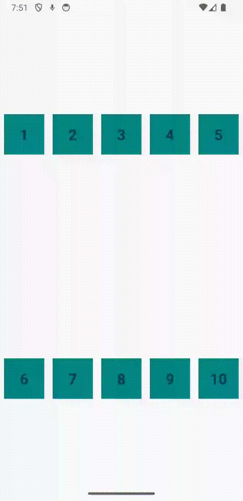

# xBerry
# Custom Grid LayoutManager and SnapHelper for RecyclerView

A custom `LayoutManager` and `SnapHelper` for Android's `RecyclerView` that supports snap helper grids with configurable rows and columns. It provides seamless scrolling of whole pages, smooth scrolling, and drag & drop between items.

## Table of Contents

- [Features](#features)
- [Usage](#usage)
- [Demo Video](#demo-video)

## Features

- **Configurable Grid Layout**: Set the number of rows and columns to display items in a horizontal grid.
- **Snap Helper Support**: Scrolls in whole pages calculated by `rows * columns`.
- **Item Animations**: Supports default RecyclerView item animations.
- **Smooth Scrolling**: Smoothly scroll to a specific page programmatically.
- **Drag & Drop Support**: Allows dragging and dropping items between two RecyclerViews.

## Usage

### Implementing the Custom LayoutManager

Create a custom `XBerryGridLayoutManager` that extends `RecyclerView.LayoutManager`. This manager will arrange items in a grid horizontally, supporting snap pagination and drag and drop animation.

```kotlin
        val gridLayoutManager = XBerryGridLayoutManager(rows = 2, columns = 5)
        recyclerView.layoutManager = gridLayoutManager

        val adapter = XBerryAdapter(mutableList)
        recyclerView.adapter = adapter

        val dragAndDropCallback = XBerryDragAndDropHelper(adapter)
        val itemTouchHelper = ItemTouchHelper(dragAndDropCallback)
        itemTouchHelper.attachToRecyclerView(recyclerView)

        val snapHelper = XBerrySnapHelper(rows = 2, columns = 5)
        snapHelper.attachToRecyclerView(recyclerView)
```

## Demo Video

